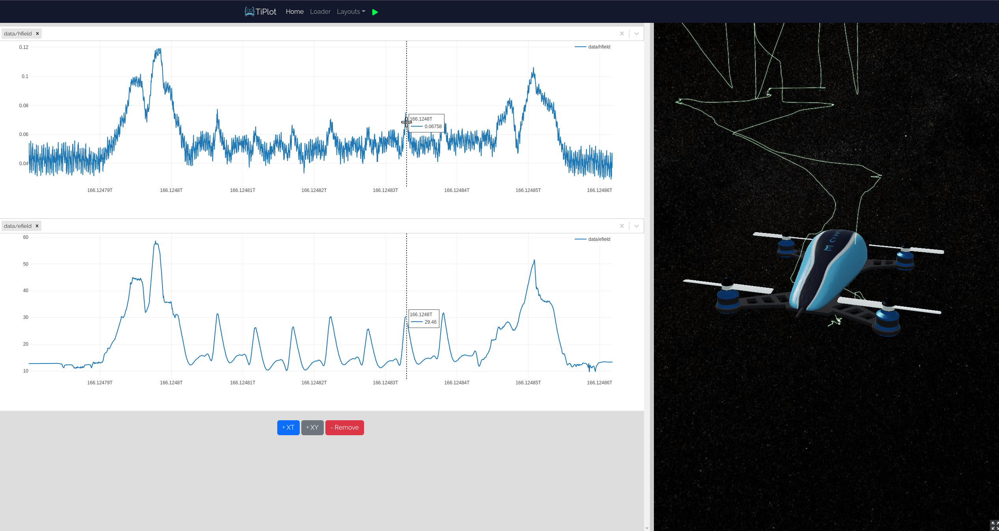

# About Tilak.io

We are an engineering services company that focus on drone technologies. 
We decided to opensource TiPlot, our log visualising tool, so the world can benefit from a nice and easy way to display logs from **PX4**, **CSV**, or even from your **Python** code or your **Jupyter Notebook**.

# Feature Request

Please reach out to us via our website [Tilak.io](https://tilak.io/), we are happy to help !

# About the project

TiPlot is a cool and simple visualising tool to analyse your drone flights. 
With this tool you can: 
- upload a ulg file, a csv or send a datadict via a socket (see snippets below)
- display the trajectory in 3d
- browse over all the fields and plot whatever you want. 

# Installation

## AppImage

Download the latest AppImage available in the [releases page](https://github.com/tilak-io/tiplot/releases).

```bash
cd ~/Downloads
chmod +x tiplot-0.1.0.AppImage
./tiplot-0.1.0.AppImage
```

## Building from source 

Clone the repo using:

```
git clone https://gitlab.com/tilak.io/tiplot.git
cd tiplot
```

Install the dependencies:

```
yarn install
pip3 install -r api/requirement.txt
```

Then you can run:

`yarn start` to run the app in your browser (this will only start the front-end).

`yarn start:electron` to run the standalone desktop app (again, only the front-end).

`yarn start:api` to run the back-end server.

`yarn serve:electron` to run the back-end and the standalone app

`yarn build` to build the html/css/js files for the front-end (in the `build` folder).

`yarn build:api` to build the back-end into one executable (in the `backend` folder).

`yarn build:electron` to build an AppImage with the back-end intagrated (in the `dist` folder).

# Getting started

TiPlot currently provides a parser for **ULG** logs (PX4 logs) and a default parser for **CSV** files. So you can directly import/upload your log file via the loader page once your app is running. (logs will automatically upload/copy files to `~/Documents/tiplot/logs`)


You can also create your own **parser** and send the parsed data via a websocket on port `5555`.

```python
import zmq
import zlib
import pickle5 as pickle
import pyulog
import pandas as pd

port = '5555'
context = zmq.Context()
socket = context.socket(zmq.REQ)
socket.connect("tcp://0.0.0.0:%s" % port)

def send_zipped_pickle(socket, obj, flags=0, protocol=-1):
    p = pickle.dumps(obj, protocol)
    z = zlib.compress(p)
    return socket.send(z, flags=flags)
```

## example of a ULG parser

```python
def parse_ulg(filename):
    ulg = pyulog.ULog(filename)
    datadict = {}
    for data in ulg.data_list:
        if data.multi_id > 0:
            name = f"{data.name}_{data.multi_id}"
        else:
            name = data.name
        datadict[name] = pd.DataFrame(data.data)
    return datadict
```

## example of a CSV parser
```python
def parse_csv(filename):
    csv = pd.read_csv(filename)
    csv['timestamp'] = pd.to_datetime(csv["timestamp"]).values.astype(np.int64) / 1e4
    datadict = {"data": csv} 
    return datadict
```

Note that the `timestamp` columns needs to be converted to `microseconds`.

Once you defined your parser, you can use the `send_zipped_pickle` function to send your parsed data to TiPlot.

```python
datadict = parse_csv('/home/hamza/Documents/tiplot/logs/16_8.0_Mission-2022-08-23_09-43-20_corrected.csv')
```

Or

```python
datadict = parse_ulg('/home/hamza/Documents/tiplot/logs/025.220809.016.ulg')
```

```
send_zipped_pickle(socket, [datadict, []])
```

Note that **you need to send an array of two values as an argument**.

- First value is our parsed data (`datadict`).

- Second value is our array of entities that we wish to be displayed on the 3D viewer (`[]` empty array if you don't want to display any entity). 

An `Entity` is defined by its:
- `name`: the name of the entity (**<span style="color:red">required</span>**).
- `alpha`: the desired transparency of the entity (*optional value between 0 and 1, default to `1`*)
- `useRPY`: a parameter to select the attitude representation  (*optional, default to `false`*).
  - True if the attitude data is represented by roll, pitch and yaw.
  - False if the attitude data is represented by quaternions.
- `position`: the position table of the entity (**<span style="color:red">required</span>**).
    - `longitude`: the longitude column.
    - `lattitude`: the lattitude column.
    - `altitude`: the altitude column.
- `attitude`: the name of the entity (**<span style="color:red">required</span>**).
  - if `useRPY` is `false`
      - `table`: the attitude table name
      - `q0`: the Qw column name.
      - `q1`: the Qx column name.
      - `q2`: the Qy column name.
      - `q3`: the Qz column name. 
  - if `useRPY` is `true`
      - `table`: the attitude table name
      - `roll`: the roll column name.
      - `pitch`: the pitch column name.
      - `yaw`: the yaw column name.

## example of the default ulg entity
```python
entity_ulg_default = {
    'name': 'ulg default entity',
    'position':{
        'table': 'vehicle_global_position',
        'longitude': 'lon',
        'lattitude': 'lat',
        'altitude': 'alt',
    },
    'attitude':{
        'table':'vehicle_attitude',
        'q0': 'q[0]',
        'q1': 'q[1]',
        'q2': 'q[2]',
        'q3': 'q[3]',
    }
}
```
## example of the default csv entity
```python
entity_csv_default = {
    'name': 'csv default entity',
    'alpha': 1,
    'useRPY': True,
    'position':{
      'table': 'data',
      'longitude': 'lon_x',
      'lattitude': 'lat_x',
      'altitude': 'altitude_x'
  },
    'attitude':{
      'table': 'data',
      'roll': 'roll_x',
      'pitch': 'pitch_x',
      'yaw': 'yaw_x',
  }
}

```
Having multiple entities should help you analyse and spot the differences between the desired flight and the actual flight data.

```python
send_zipped_pickle(socket, [datadict, [desired_behaviour, actual_behaviour]])
```


## Layouts

A layout is the collection of table/column keys used in the plot.

The *current* layout is always saved, and is the default layout that will be loaded once you re-open the app.

In addition, you can save and name multiple layouts and load them whenever you want.

You can also import/export the layout in a `json` format.


