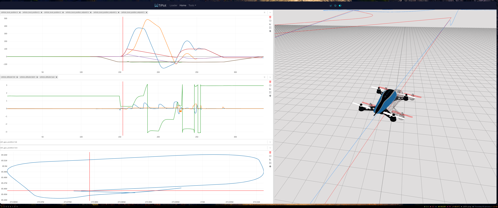

# About Tilak.io

We are an engineering services company that focus on drone technologies. 
We decided to opensource TiPlot, our log visualising tool, so the world can benefit from a nice and easy way to display logs from **PX4**, **CSV**, or even from your **Python** code or your **Jupyter Notebook**.

# Feature Request

Please reach out to us via our website [Tilak.io](https://tilak.io/), we are happy to help !

# About TiPlot

TiPlot is an open-source visualisation tool for flight logs. With TiPlot, you can easily visualize your flight data in 2D graphs and a 3D view, helping you better understand the performance and behavior of your unmanned aerial vehicle (UAV).



## Features

- Supports multiple file formats, including : 
  - PX4's .ulg
  - Generic .csv
  - DJI's .DAT
  - QGroundControl's .tlog
  - Ardupilot's .BIN Logs.
- 2D yt and xy graphs for visualizing flight data.
- 3D viewer for displaying the paths of your UAVs.
- Add multiple UAVs to compare flights.
- Sync the 3D view with a specific timestamp by hovering over it.
- Ability to send a data dictionary and entities to be displayed in the 3D view over TCP port `5555` from a Python script or a Jupyter notebook.
- Layouts are automatically saved after every change.
- Drag and drop plots to reposition them.
- Plot multiple fields from different topics in yt graphs.
- X scale of all graphs is synced when zooming in.
- Y scale of graphs is automatically set to fit all available data in the timestamp range.
- Change view layout from split to detached to detach the 3D view as a new window.
- Adjust camera settings and change background color and show grids on the 3 axis in the settings page.

## Installation

### Prebuilt AppImage

To install TiPlot using the prebuilt AppImage, follow these steps:

1. Download the latest AppImage from the [releases page](https://github.com/tilak-io/tiplot/releases/latest).
2. Make the AppImage executable by running:
```bash 
cd ~/Downloads
chmod +x tiplot-1.x.x.AppImage
```
3. Run the AppImage:
```bash 
./tiplot-1.x.x.AppImage
```

### Building from source

To build TiPlot from source, follow these steps:

1. Clone the repository:
```
git clone https://github.com/tilak-io/tiplot
cd tiplot
```
2. Install dependencies:
```
# Install Node dependencies 
yarn install
# Install Python dependencies:
pip3 install -r api/requirements.txt
```
3. Start the API server:

```
yarn start:api
```
In a new terminal, start the front end: 
```
yarn start
```

## Usage
To use TiPlot, follow these steps:

1. Launch TiPlot's AppImage, exe or compiled build.
2. Click the "Browse" button to select a flight log file.
3. Add a graph (yt or xy).
4. Use the ALT + hover feature to sync the 3D view with a specific timestamp.
5. Use the entities page to choose the UAV's position/attitude tables.

##  Sending data from a Python script or Jupyter notebook
To send data to TiPlot from a Python script or Jupyter notebook, you can use the following code:
```python
import zmq
import zlib
import pickle
import pyulog
import pandas as pd

port = '5555'
context = zmq.Context()
socket = context.socket(zmq.REQ)
socket.connect("tcp://0.0.0.0:%s" % port)

def send_zipped_pickle(socket, obj, flags=0, protocol=-1):
    p = pickle.dumps(obj, protocol)
    z = zlib.compress(p)
    return socket.send(z, flags=flags)

send_zipped_pickle(socket, [datadict, []])
```

Note that `datadict` is the data dictionary returned by the parser.
`[]` is the entities array (empty array means we don't want to display anything on 3d view)

For more info check out the Jupyter notebooks in the [templates](https://github.com/tilak-io/tiplot/blob/main/templates) folder.


## Contributing
We welcome contributions to TiPlot. If you would like to contribute, please follow these steps:

1. Fork the repository.
2. Create a new branch for your changes.
3. Make your changes and commit them to your branch.
4. Push your branch to your forked repository.
5. Create a new pull request.

## License
This project is licensed under the Apache License, Version 2.0. See the [LICENSE](https://github.com/tilak-io/tiplot/blob/main/LICENSE.md) file for details.
